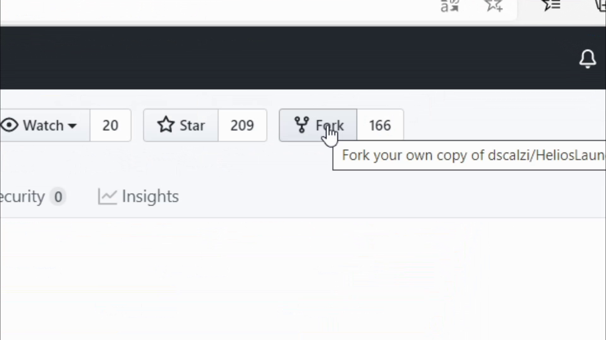

# Helios Launcher Partie 1: Les débuts

## Bienvenue
Pour ce premier tuto consacré au développement du Helios Launcher, nous allons modifier la page de bienvenue, changer le logo, le nom du dossier où sont stockées les données et le nom du launcher. Nous allons aussi créer le fork du Helios Launcher et installer les logiciels requis pour développer correctement le Helios Launcher.

## Vidéo
 Ce tutoriel est la version texte de la vidéo que vous pouvez regardez en cliquant sur l'image ci-dessous:
 <a href="http://www.youtube.com/watch?v=YeLf8wJVlVI" target="_blank"></a>

## Conditions d'utilisation
 Ce n'est pas une blague, Daniel Scalzi (l'auteur du Helios Launcher) a mis des conditions d'utilisations pour des tièrces parties. <a href="https://github.com/dscalzi/helioslauncher#note-on-third-party-usage" target="_blank">Les voici en version anglaise.</a> Je vous les ai traduites ci-dessous:
 ```   
 Note sur l'usage par des tiers  
  Vous osez utiliser ce logiciel dans votre propre projet tant que ces conditions sont réunies:  
   -Vous devez créditer expréssément l'auteur original (Daniel Scalzi)  
    -Vous devez inclure un lien vers le code source original sur la page "À propos" du launcher.  
    -Créditer l'auteur et fournir un lien vers le code source du launcher sur la page de téléchargement du launcher, et sur chaque page concernant ce dernier.  
   -Le code source reste public en tant que fork(=copie) du réferentiel  
  Nous nous réservons le droit de modifier ces conditions en tout temps, veuillez vérifier régulièrement si il y a des changements de conditions
``` 

## Créer le fork du Helios Launcher
 <a href="https://github.com/join" target="_blank">Créez-vous un compte GitHub</a>. Pour cela, vous devrez indiquer un nom d'utilisateur, un email, et un mot de passe. Vérifiez votre adresse email, et rendez-vous sur <a href="https://github.com/dscalzi/helioslauncher" target="_blank"> la page du Helios Launcher</a>. ![\[Photo page Helios Launcher\]](assets/helioslauncher.jpg)Pressez ensuite le bouton "Fork": 
 Attendez quelques instants le temps que GitHub clone le référentiel du Helios Launcher sur votre compte.  
 Cette étape dure environ 10-20 secondes...  
 À ce stade, le launcher est prêt, mais on a quand-même envie de changer le nom du Helios Launcher, surtout sur GitHub...  
 C'est ce que nous allons faire...
## Changer le nom du launcher sur GitHub
 Nous allons changer le nom du fork GitHub, car nous n'avons pas forcément tous envie qu'il s'appelle `HeliosLauncher`  
 Pour éviter cela, allez dans les réglages de votre référentiel: ![\[Photo Bouton paramètres\]](assets/reglagesgithub.jpg)
 Vous pourrez changer le nom de votre launcher puis cliquer sur `Rename`  
 ![\[Renommer\]](assets/renamegithub.jpg)  
## Installer les programmes pour modifier le code source
 Nous allons devoir utiliser 3 programmes:  
 **Node.JS**  
 Ce logiciel sert à programmer en JavaScript. Il est au launcher ce qu'est le moteur à la voiture.  
 Pour le télécharger, rendez vous <a href="https://nodejs.org/fr/download" target="_blank">hmmm ici</a> et téléchargez la dernière version LTS pour votre ordinateur.  
 **GitHub Desktop**  
 Il servira à "pousser" les modifications sur GitHub. Rendez vous <a href="https://desktop.github.com" target="_blank">ici</a> pour le téléchargez. Vous devrez ensuite vous connecter sur GitHub via votre navigateur internet.  
 **Visual Studio Code**  
 Il sert à modifier le code source de notre launcher. Vous pouvez le télécharger gratuitement sur <a href="https://code.visualstudiocode.com" target="_blank">le site officiel</a>.  

## Télécharger notre fork  
 Nous avons crée notre fork, mais il faut le télécharger localement, donc nous allons utiliser GitHub Desktop.  
 Démarrez ce dernier, puis connectez-vous si ce n'est pas déjà fait. Ensuite, pressez le bouton `Clone a repository from the internet` puis séléctionnez votre fork.  
 Changez éventuellement l'emplacement de téléchargement. Puis pressez le bouton `Clone`  
 ![\[Bouton clone\]](assets/clone.jpg)  
 Après le téléchargement, vous aurez un popup vous demandant comment vous avez prévu d'utiliser le fork. ![\[Photo Usage fork\]](assets/usagefork.jpg)  
 Choisissez la deuxième option puis confirmez.  
## Modifier le fork
 Pressez le bouton `Open in Visual Studio Code`  
 Nous allons modifier le fichier package.json que vous pouvez trouver dans le panneau à gauche. Ci-dessous, un exemple de package.json:  
 ```json
 {
  "name": "nomdulauncher",
  "version": "1.7.0",
  "productName": "Nom du launcher",
  "description": "Une description",
  "author": "Daniel Scalzi (https://github.com/dscalzi/) et votre nom",
  "license": "UNLICENSED",
  "homepage": "https://github.com/PseudoGitHub/nomdulauncher",
  "bugs": {
    "url": "https://github.com/PseudoGitHub/nomdulauncher/issues"
  },
  "private": true,
  "main": "index.js",
  "scripts": {
    "start": "electron .",
    "cilinux": "node build.js WINDOWS && node build.js LINUX",
    "cidarwin": "node build.js MAC",
    "dist": "cross-env ELECTRON_BUILDER_ALLOW_UNRESOLVED_DEPENDENCIES=true node build.js",
    "dist:win": "npm run dist -- WINDOWS",
    "dist:mac": "npm run dist -- MAC",
    "dist:linux": "npm run dist -- LINUX",
    "lint": "eslint --config .eslintrc.json ."
  },
  "engines": {
    "node": "12.x.x"
  },
  "dependencies": {
    "adm-zip": "^0.4.14",
    "async": "^3.2.0",
    "discord-rpc": "^3.1.1",
    "ejs": "^3.1.3",
    "ejs-electron": "^2.0.3",
    "electron-updater": "^4.3.1",
    "fs-extra": "^9.0.1",
    "github-syntax-dark": "^0.5.0",
    "jquery": "^3.5.1",
    "request": "^2.88.2",
    "semver": "^7.3.2",
    "tar-fs": "^2.1.0",
    "winreg": "^1.2.4"
  },
  "devDependencies": {
    "cross-env": "^7.0.2",
    "electron": "^9.0.3",
    "electron-builder": "^22.7.0",
    "eslint": "^7.2.0"
  },
  "repository": {
    "type": "git",
    "url": "git+https://github.com/PseudoGitHub/nomdulauncher.git"
  }
}
```  
 Une fois ceci fait, **rappelez-vous que si vous modifiez ce fichier, vous devrez executez la commande `npm i` comme maintenant.** Les modules Node.JS seront téléchargés et nous pouvons désormais modifier le nom du launcher.  
  
  
 Ouvrez le fichier `app/frame.ejs` et allez à la ligne 16 afin de modifier le nom de la fenêtre. Elle devrait ressembler à ça:  
 ```javascript
 <span id="frameTitleText">Helios Launcher</span>
 ```  
 Remplacez `Helios Launcher` par le nom de votre launcher.  
  
    
 Allez dans le fichier `app/welcome.ejs` et adaptez les lignes 8 à 23 selon vos besoins. Le but est de modifier la page de bienvenue. Voici un exemple: 
```javascript  
    <div id="welcomeContent">
        
        <span id="welcomeHeader">Bienvenue sur mon serveur</span>
        <span id="welcomeDescription">Bienvenue sur mon serveur, j'espère que vous l'apprecierez!</span>
        <br>
        <span id="welcomeDescCTA">On y va?</span>
        <button id="welcomeButton">
            <div id="welcomeButtonContent">
                CONTINUER
                <svg id="welcomeSVG" viewBox="0 0 24.87 13.97">
                    <defs>
                        <style>.arrowLine{fill:none;stroke:#FFF;stroke-width:2px;transition: 0.25s ease;}</style>
                    </defs>
                    <polyline class="arrowLine" points="0.71 13.26 12.56 1.41 24.16 13.02"/>
                </svg>
            </div>
        </button>
    </div>
```  
 Retournez dans GitHub Desktop puis faites: `Repository>Show in explorer`. Nous allons modifier le logo du launcher.  
 Ouvrez le dossier `app/assets/images` puis supprimez le fichier `SealCircle.png`. Copiez votre logo (au format carré) et renommez-le `SealCircle.png`.  
 Fermez l'explorateur puis retournez dans `Repository>Show in explorer` puis allez dans le dossier `Build`. Supprimez le fichier `icon.png`, copiez votre logo dans le dossier et renommez-le `icon.png`.  
  
  
 Retournez dans Visual Studio Code et ouvrez le fichier `app/app.ejs` afin de modifier le nom du launcher qui apparaîtra dans le alt+tab.  
 Allez à la ligne 4 qui doit ressembler à ceci:  
 ```html
<title>Helios Launcher</title>
```  
Remplacez `Helios Launcher` par le nom de votre launcher...  
  
  
  
  
 Allez, une dernière modification: ouvrez le fichier `app/assets/js/configmanager.js` afin de changer l'emplacement de stockage des données et modifiez la ligne 9 qui ressemble à ceci:  
```javascript
const dataPath = path.join(sysRoot, '.helioslauncher')
```  
 Remplacez `.helioslauncher` par `.nomdevotrelauncher`
  
 Vous êtes prêt(e) à démarrer le launcher. Tapez simplement dans le terminal
 ```batch
 npm start
 ```  
Nous avons presque fini le tuto. Il faut juste pousser les modifications sur GitHub.  
  
## Pousser les modifications sur GitHub
 Retournez dans GitHub Desktop et remplissez en bas à gauche le formulaire en expliquant (ou pas) les changements effectués. Puis pressez `commit to master` ![\[Photo Bouton Commit\]](assets/commit.jpg)  
 Pour finir pressez `push origin` ![\[Photo Bouton push\]](assets/push.jpg)


## Enjoy
 C'est la fin de ce tutoriel. La suite arrive bientôt alors n'hésitez pas à checker régulièrement <a href=".." target="_blank">cette page</a> pour savoir si la suite est disponible, et à bientôt!